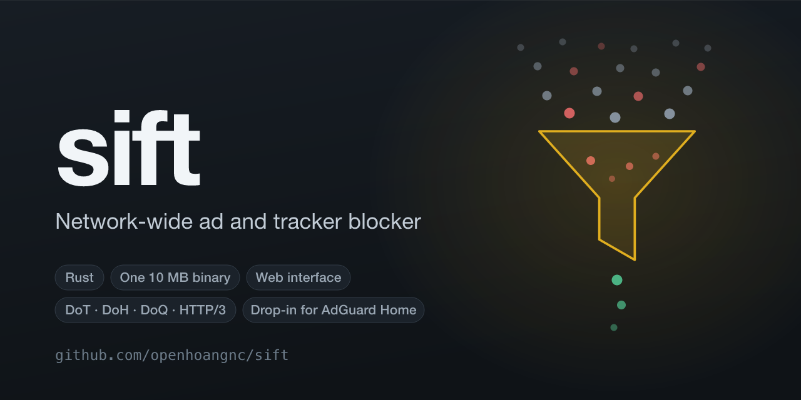

# sift

[](https://github.com/openhoangnc/sift/actions/workflows/docker.yml)
[](https://github.com/openhoangnc/sift/pkgs/container/sift)

**Sift is a network-wide ad and tracker blocker.** Point your router or your
devices at it, and every DNS query on the network goes through the filter lists
you subscribe to. It is one static binary of about 10 MB, or a 57 MB container
image, and it runs on anything from a Raspberry Pi upward.

It serves plain DNS, DNS-over-TLS, DNS-over-HTTPS, DNS-over-QUIC and HTTP/3;
keeps per-client settings, a query log and statistics; and has a web interface
for all of it — written for this project in React and TypeScript, English only.

It is also a **drop-in replacement for [AdGuard
Home](https://github.com/AdguardTeam/AdGuardHome) v0.107.79**. It reads and
writes the same `AdGuardHome.yaml`, the same query log, the same `stats.db` and
the same sessions, serves the same control API, and ships in an image with the
same runtime contract — so it can take over an existing installation in place
and hand it back without changing a file. That interchangeability is a
property, not the point: [Compatibility, and how it was
checked](#compatibility-and-how-it-was-checked) is what it rests on.

Sift is not produced, endorsed or supported by AdGuard; see
[NOTICE.md](NOTICE.md). Documentation is under [`docs/`](docs/):
[FAQ](docs/faq.md) · [Configuration](docs/configuration.md) ·
[Clients](docs/clients.md) · [Encryption](docs/encryption.md) ·
[Privacy](docs/privacy.md).

## Install on a machine

```bash
curl -s -S -L https://raw.githubusercontent.com/openhoangnc/sift/main/scripts/install.sh | sh -s -- -v
```

That installs sift into `/opt/AdGuardHome`, registers it with systemd (or
launchd on macOS) under the name `AdGuardHome`, and starts it. Open
`http://<this machine>:3000` and the setup wizard takes it from there. Run the
same line again later and it upgrades in place; run it on a machine that is
already up to date and it does nothing.

**Run it on a machine already running AdGuard Home and it takes that
installation over.** The binary is replaced and nothing else is: the config
file, the whole data directory and the unit file stay exactly as they are,
because both builds read and write them in the same formats under the same
names. The Go binary is kept beside the new one as `AdGuardHome.bak`, so going
back is three commands, which the script prints when it finishes.

The archives are statically linked against musl, so one build per architecture
runs on any distribution however old its glibc, and are published with a
`checksums.txt` the script verifies before it replaces anything. It also runs
the downloaded binary once, before the running server is touched: an archive
for the wrong architecture fails then rather than after the swap.

| | |
|---|---|
| `-v`, `-V` | turn progress messages on or off |
| `-u` | remove the binary and the service, and keep the config file and the data directory |
| `-r` | install again even when the version on offer is the one already installed |
| `-t v0.5.0` | install a particular release rather than the newest |
| `-o /srv` | install into `/srv/AdGuardHome`; the default is wherever the installed service already runs from, or `/opt` |
| `-C`, `-O` | build the archive name for another cpu or operating system |

Published archives: `linux_amd64`, `linux_arm64`, `linux_armv7`,
`darwin_amd64` and `darwin_arm64`. Anything else builds from source —
[Building](#building).

## Install with Docker

A multi-architecture image — `linux/amd64` and `linux/arm64` — is published to
the GitHub Container Registry on every push to `main`:

```bash
docker pull ghcr.io/openhoangnc/sift:latest
```

```yaml
services:
  adguardhome:
    image: ghcr.io/openhoangnc/sift:latest
    container_name: adguardhome
    restart: unless-stopped
    volumes:
      - ./work:/opt/adguardhome/work
      - ./conf:/opt/adguardhome/conf
    ports:
      - 53:53/tcp
      - 53:53/udp
      - 3000:3000/tcp
```

Or directly:

```bash
docker run -d --name adguardhome \
  -v "$PWD/work:/opt/adguardhome/work" \
  -v "$PWD/conf:/opt/adguardhome/conf" \
  -p 53:53/tcp -p 53:53/udp -p 3000:3000/tcp \
  ghcr.io/openhoangnc/sift:latest
```

The image is a drop-in for `adguard/adguardhome`: same binary path, working
directory, exposed ports and entrypoint arguments. An existing deployment only
changes its `image:` line, and keeps its config and data directory as they are
— bind mounts or named volumes alike, and nobody is signed out. Switching back
is the same one-line change, and costs nothing: both builds read each other's
`AdGuardHome.yaml`, `querylog.json`, `stats.db`, `sessions.db` and downloaded
filter lists.

| Tag | What it points at |
|---|---|
| `latest` | the newest build of `main` |
| `sha-<short>` | one specific commit |
| `1.2.3`, `1.2` | a `v1.2.3` release tag |

The registry keeps only the **newest three releases**; everything older is
deleted, `sha-` tags included. Deploy against a `sha-` tag rather than `latest`
if you want a restart to redeploy the same bytes, and mirror the image into
your own registry — or rebuild it from the commit — if you need one to stay
pullable for longer than three builds.

To build the same image yourself:

```bash
docker build -f docker/Dockerfile -t sift .
```

## Updating

When a newer release exists, the top bar says so and offers **Install**. That
downloads the archive for this machine, checks it against the published
`checksums.txt`, runs the new binary — once for its version and once over your
real configuration with `--check-config` — and only then moves it into place
and restarts into it. The binary it replaced and a copy of your config file are
left in `<work>/agh-backup`.

The button is offered only where it would work. It is **not** offered inside a
container, where the image is what gets updated and a replaced binary is
discarded by the next `docker run`; nor where the executable's directory is
read-only; nor where a restart could not bind the ports the server uses now. In
each of those cases the profile menu says which one it is rather than simply
omitting the button, and it says so too when the check could not reach GitHub
and when there is nothing newer to install. `--no-check-update` switches the
whole thing off, check included.

For a container, pull a newer image. For a machine installed from the shell,
run the installer line again.

## What it does

- **Filtering.** Blocklists and allowlists in AdGuard's and uBlock's syntax,
  your own rules, and the system hosts file. The **Filters** page offers a
  catalogue of 66 vetted lists, each with a written note, a measured rule count
  and tags — including a flag for the country a regional list serves — so the
  picker answers "which one do I want?" rather than listing names.
- **Blocked services.** A catalogue of 139 services, blockable globally or per
  client, on a weekly schedule that can pause them for chosen hours.
- **Safe search**, enforced for Bing, DuckDuckGo, Ecosia, Google, Pixabay,
  Yandex and YouTube.
- **Encrypted DNS, inbound and out.** DNS-over-TLS, DNS-over-HTTPS,
  DNS-over-QUIC and HTTP/3 listeners on a reloadable certificate, and upstreams
  over any of them. Apple `.mobileconfig` profiles are generated for both.
- **Clients.** Matched by address, subnet, MAC or ClientID, most specific
  first, with their own filtering, safe search, blocked services, upstreams and
  log exclusions. Names are discovered from the hosts file, the ARP table,
  reverse DNS and WHOIS.
- **Query log and statistics.** Every query with its verdict, the rule that
  produced it and the list that rule came from — filterable by domain, client,
  verdict or list. Statistics are kept per hour and drawn on the dashboard.
- **Rewrites, DNS64, DDR, EDNS client subnet, DNSSEC, bogus-NXDOMAIN
  filtering, rate limiting and access lists**, each behaving as AdGuard Home's
  does.
- **Operations.** A systemd or launchd service, log rotation, privilege
  dropping, ipset, a pidfile, and self-update.

## What is excluded, and why

Three features are decisions rather than gaps. Nothing else in the Go build's
surface is missing; `TASK.md` records the full state and the smaller deviations
(cited rule on ties, `gob` byte-equality, ipset through the command rather than
netlink, and a few more).

- **Safe browsing and parental control.** Both were implemented over AdGuard's
  hash-prefix protocol, and both were removed. They were the only thing here
  that sent anything derived from your queries to a third party: the hostname
  never left, but a two-byte prefix of each parent label's SHA-256 went to
  AdGuard's family resolver for every name that reached that step, and a bucket
  that was not cached cost a round trip before the query could be answered.
  Block malware, phishing or adult content with a filter list instead — the
  catalogue carries lists for each. `/control/safebrowsing/status` and
  `/control/parental/status` report the features off whatever the config holds,
  and every change answers **501**. Your stored settings round-trip untouched,
  per-client ones included.

- **DHCP.** This build will not serve DHCP; run it on your router or a
  dedicated service. `/control/dhcp/status` always reports the feature off and
  every settings change answers **501**, so the web interface cannot store DHCP
  configuration that nothing would act on. The `dhcp:` section of the config
  file is still read and written unchanged, so switching back to the Go build
  keeps your settings, and the DHCP settings page is gone from the web
  interface rather than present and inert.

- **DNSCrypt.** It is the one remaining protocol needing cryptography this
  project does not already have — X25519, Ed25519 and a NaCl-style secretbox —
  plus a signed-certificate protocol and AdGuard's provider-key file format,
  and a mistake there fails silently rather than visibly. `port_dnscrypt` and
  `dnscrypt_config_file` round-trip through the config untouched; the port is
  never bound, and an `sdns://` upstream is reported at startup and skipped.
  DNSCrypt itself is still in use — AdGuard's own provider list publishes
  stamps for it — so front sift with `dnscrypt-proxy` if you need it.

## Where it goes further

Compatibility is the constraint, not the ceiling. These are the places this
build does something the Go one does not, each with the reason it was worth
diverging for — and where a thing is parity with AdGuard's own libraries
rather than an invention, it says so.

- **Upstream connections outlive the query.** Every encrypted transport pays
  for a handshake before it can carry anything, and paying it per query cost,
  measured against a public resolver, 103 ms on DoT, 108 on DoH, 110 on DoQ
  and 112 on HTTP/3 above the one-round-trip floor — against roughly 40 µs
  of local processing for the same query. Connections are kept instead:
  HTTP/2, HTTP/3 and QUIC multiplex, so one serves every query at once;
  DoT and plain TCP are checked out
  exclusively and returned once a complete, validated reply has been read.
  Dialling is single-flight, so a burst against a cold upstream opens one
  connection rather than one each, and a *failed* dial is remembered for a
  moment so a dead upstream fails fast instead of queueing every query behind
  a ten-second timeout.

  Keeping them is parity, not invention: dnsproxy pools DoT, caches an
  `http.Client` for DoH and keeps one QUIC connection for DoQ. Two things here
  go past it — **plain TCP is pooled too**, which dnsproxy dials per query,
  and the HTTP/2-versus-HTTP/3 choice is **remembered per upstream** with a
  timed retry rather than re-raced on every query.

- **A popular name is refreshed before it expires.** An entry in the last
  tenth of its TTL that has been asked for more than once is fetched again out
  of band, so a name under constant query is never served stale at all. Not an
  AdGuard Home feature, and given no config key of its own on purpose: it is
  gated on `cache_optimistic`, the setting that already says a stale answer is
  acceptable, so with optimistic caching off the cache behaves exactly as the
  Go build's. A refresh has no client, so it is not rate limited, not counted
  in the statistics and not written to the query log.

- **A renewed certificate is picked up without being told.** The Go build
  reads `certificate_path` and `private_key_path` at startup and when the
  config is saved, so a certbot renewal is served only after the next restart
  — a deployment that never restarts serves an expired certificate. Here the
  maintenance tick digests what the files hold and installs a pair that
  differs from the one being served, after it has proved itself against
  rustls. Comparison is of contents rather than mtime, so a script that
  rewrites both files nightly costs a digest and nothing else.

- **The blocklist picker says what each list is for.** Upstream's picker
  offers 64 names and a URL each. This one carries 66 lists, and for every one
  of them a sentence or two written here — what it blocks, who it suits, what
  it will break — a closed vocabulary of 23 tags, a flag for the country a
  regional list serves, and a rule count **measured by downloading the list**,
  6.47 million rules across the catalogue. The measurement doubles as
  validation: the importer refuses to publish a catalogue in which anything
  404s, comes back empty, carries a tag outside the vocabulary or has no note,
  so a dead list is caught at import rather than by whoever picked it. The tag
  `starter` selects exactly five, which is the question most people arrive
  with.

- **The web interface is this project's own.** React 19, TypeScript, ECharts
  and Vite — the entire runtime dependency list, with no state library, no
  component library and no CSS framework. It is built as three separate
  documents, brotli-compressed at quality 11 (1.3 MB of assets to 0.4 MB
  embedded in the binary), and served with content-hashed names under
  `static/` marked `immutable` for a year while everything else revalidates
  against an `ETag` and gets a **304** without the body being touched. It is
  responsive down to 375 px and tested there, and it is English only, which is
  a decision rather than an omission — a translation is someone else's
  writing, and the wording here is now its own.

- **The query log can be filtered by the list that blocked.** `filter_id` on
  `/control/querylog` keeps only the entries a rule from that list matched,
  across the whole log rather than the page in hand — so "what is this list
  actually doing to me?" is one click from the Filters page. It is parsed
  leniently, so a request upstream would have answered never becomes a 400.

- **An update is checked before it is installed, and reversible after.** The
  archive is verified against the published `checksums.txt`, and the new
  binary is then run twice before anything moves — once for its version, once
  over your real configuration with `--check-config` — because the failure
  being prevented is a resolver that no longer starts. The binary is replaced
  by renaming, never by writing over the running file, and the one it replaced
  is kept beside it. The shell installer goes further still: it watches the
  service for eight seconds afterwards and puts the old binary back if it does
  not stay up, because on the machine whose resolver this is, that difference
  is the whole network.

- **The interface says why a button is missing.** `/control/version.json`
  carries two fields upstream has no use for: `check_failed` and
  `autoupdate_blocked_by`. Without them, "you are up to date", "nobody
  answered when we asked" and "there is a new version and this machine cannot
  install it" all look identical — a missing Install button. The profile menu
  names which one it is instead.

## Measured against the Go build

Both running the same config and the same 179,334-rule AdGuard DNS filter, on
the same machine.

| | Go v0.107.79 | sift | |
|---|---:|---:|---|
| Docker image | 110 MB | **56.9 MB** | 1.9× smaller |
| Binary (with web UI) | 33.6 MB | **20.3 MB** | 1.7× smaller |
| Binary (`dist` profile) | 33.6 MB | **10.7 MB** | 3.1× smaller |
| Memory, idle with lists loaded | 85.2 MB | **73.2 MB** | 1.2× less |
| Memory, after load | 186.8 MB | **83.1 MB** | 2.2× less |
| Throughput (blocked queries) | 39,059 q/s | **51,509 q/s** | 1.32× |
| Latency p90 | 2.896 ms | **1.436 ms** | 2.0× better |
| Latency p99 | 6.178 ms | **1.960 ms** | 3.2× better |

Memory, throughput and latency were measured in one sitting with both servers
running the same config and the same filter list, 15 seconds at concurrency 64
against 5,000 blocked names. The load generator in
`crates/sift/examples/loadgen.rs` runs on the same machine as the
servers and so competes with them for CPU; treat the ratios as meaningful and
the absolute numbers as a floor. The binary sizes compare against AdGuard's
published release, not a local `go build`, which is larger because it keeps
its debug info; both have shrunk a little since, as features were removed.

### At a larger list count

That table is one 179,334-rule list, which is a modest deployment. A real one
with **37 lists and 2,272,040 rules**, measured the same way on the same
machine with the same data:

| | Go v0.107.79 | sift | |
|---|---:|---:|---|
| Time to answer DNS from a cold start | 4 s | **2 s** | 2× quicker |
| Memory, after loading the lists | 346 MB | **267 MB** | 1.3× less |

It took work to get there, and the starting point is worth recording: the same
deployment once took **55 seconds and 4.2 GB** — fourteen times Go's startup
and twelve times its memory. Three things were wrong, each found by measuring
rather than reading:

- **Every rule that is not `||domain^` compiled a regular expression at load.**
  156,557 of them here. They are built on first use now, which was 22 of those
  55 seconds.
- **The match path allocated per candidate rule and per query** — a formatted
  `String` to test an empty `$badfilter` set, a `format!` for the URL, a hash
  set for deduplication.
- **The indexes were far larger than the data they held**: a domain index of
  boxed key strings costing 148 MB for 1.1M domains, and rule text copied into
  the engine when the list manager already held every byte of it.

The shortcut index is the piece worth reading: `crates/sift-filter/src/shortcut.rs` replaced an Aho-Corasick automaton, which is the textbook answer
and was the wrong one here. Its 37.6 MB is walked one state-transition per
byte, each dependent on the last, so a hostname's length buys a chain of cache
misses. The haystack is tiny and the patterns are long, so each pattern is
filed instead under whichever eight-byte window of itself is *rarest* across
the whole set, and a query hashes its own windows independently — 7.4 MB, and
the probes overlap in the memory system instead of chaining.

Guards: `rules_needing_an_expression_load_as_cheaply_as_plain_ones` in
`crates/sift-filter/tests/differential.rs` fails if expressions go back to
being built at load. `cargo run --release -p sift-filter --example loadprofile <dir of lists>` prints the phase timings, a footprint breakdown and per-query
costs, which is how all of the above was measured.

## Compatibility, and how it was checked

Every claim below was verified against a running AdGuard Home v0.107.79, not
read off the source.

| Surface | Status | How it was checked |
|---|---|---|
| `AdGuardHome.yaml` (schema 34) | byte-identical | The same sequence of API changes applied to both servers produces byte-identical config files, quoting included. |
| Filtering verdicts | exact | 4,190 domains against the real 179,334-rule list: every verdict matches. 99.2% also cite the same rule; the rest are ties where upstream's choice falls out of its index's bucket balancing. |
| DNS responses | exact | 2,046 names over A and AAAA against both servers: no verdict differs. |
| HTTP API | exact | Response shapes for all 25 endpoints the web UI loads. |
| `querylog.json` | byte-identical | 43 real log lines, one per distinct entry shape, re-encode byte for byte. |
| `stats.db` (bbolt + gob) | interoperable | The Rust server wrote a database; a Go AdGuardHome read it and reported the same counts. Go's own gob encoder is not byte-stable, so byte-equality is not the bar. |
| Filter lists on disk | same files | The same `data/filters/<id>.txt` layout; an existing download is used as-is. |
| DNS-over-TLS, -HTTPS and -QUIC | interoperable | AdGuard's own dnsproxy client, verifying the certificate, resolves through all three listeners. |
| Config migration | all 34 steps | A port of `internal/configmigrate`; a config from any older schema is upgraded and the upgraded file written back. |
| `sessions.db` | same layout | Sessions are stored the way the Go build stores them, so a restart signs nobody out and either build reads the other's file. |
| Docker | same contract | Entrypoint, command, working directory, user, volumes, exposed ports, environment, healthcheck and stop signal are identical. A configured `adguard/adguardhome` container was swapped to this image on the same volumes and swapped back: the config file survived byte for byte, sessions stayed valid in both directions, and each build read the other's `querylog.json`, `stats.db` and filter cache. |

Two things are deliberately **not** shared with the Go build. The version this
reports is its own, not v0.107.79 — it is the only way to tell which of the two
binaries is installed. And the web interface is this project's, so the
control API carries one path and a few fields upstream has no use for; the two
builds never serve the same interface, so nothing is broken by that.

Reproduce it with `scripts/verify.sh` (see [Verifying](#verifying)).

## Layout

```
crates/sift-core      shared types matching Go's wire and on-disk forms
crates/sift-config    AdGuardHome.yaml: schema 34, and a Go-yaml.v3 emitter
crates/sift-filter    the rule engine, list storage, services catalogue
crates/sift-dns       wire codec, cache, upstreams, listeners, resolver
crates/sift-querylog  querylog.json
crates/sift-bolt      a minimal bbolt reader and writer
crates/sift-gob       Go `gob` for the statistics unit
crates/sift-stats     statistics collection, aggregation and persistence
crates/sift-api       the control API and the embedded web interface
crates/sift           the binary
web/client            the web interface: React, TypeScript, ECharts, Vite
web/build             the same, built and brotli-compressed for embedding
docs                  the documentation the web interface links to
```

## Building

```bash
cargo build --release            # fast to build, fast to run
cargo build --profile dist       # fat LTO, stripped: the small binary
```

The workspace is split so `cargo` parallelises across crates, dependencies are
compiled at `opt-level = 2` even in debug builds so they are paid for once, and
debug info is line tables only. An incremental rebuild after touching one file
is about 8 seconds.

The web interface's sources live in `web/client` — React 19, react-router and
ECharts, and nothing else at runtime — and the build is committed under
`web/build`, brotli-compressed: ~1.3 MB of JavaScript and CSS become 0.4 MB in
the binary. Rebuild it after any change under `web/client`:

```bash
scripts/build-frontend.sh         # needs Node
```

Hashed bundles go under `web/build/static/` and are served `immutable` for a
year; everything else revalidates and is answered with a `304` when nothing
moved.

To work on it against a running server, with hot reload:

```bash
cd web/client && npm install && npm run dev    # port 5173, API on :3000
```

## Running from source

```bash
cargo run --release -- --no-check-update -c ./AdGuardHome.yaml -w ./work
```

## Verifying

`cargo test --workspace` runs 771 unit and integration tests, including the
differential against the real filter list and the query-log and gob golden
files — none of which need a network or a running Go build.

The cross-implementation checks need both servers running:

```bash
scripts/verify.sh
```

It builds the Go reference from `upstream/`, starts both, and runs the config,
DNS, API and statistics comparisons described above.

The drop-in claim has its own check, which needs only Docker and the two
images:

```bash
tests/compat/dropin.sh
```

It configures a real `adguard/adguardhome` container, generates traffic, swaps
this image in on the same volume, swaps back, and has the Go build read
everything this one wrote — 27 assertions, from the image's entrypoint and
exposed ports through to whether a session issued by one build is still
honoured by the other.

## Continuous integration

One workflow runs on its own. `.github/workflows/docker.yml` builds the image
for both architectures on native runners — no emulation — publishes a single
multi-architecture tag to GHCR, and then prunes the package back to the newest
three releases. Documentation-only commits are skipped, and a newer push
cancels an in-flight build.

`.github/workflows/release.yml` builds the installer's archives for every
published architecture and attaches them to a `v*` tag.

`.github/workflows/ci.yml` — formatting, lints, the test suite, and the
differential against a freshly cloned AdGuard Home — is `workflow_dispatch`
only. It costs nothing until it is started from the Actions tab, because all of
it also runs locally: `cargo test --workspace` and `scripts/verify.sh`.

## Licence

GPL-3.0, matching AdGuard Home. This is a derivative work: it redistributes
AdGuard's blocked-services catalogue, their safe-search rules, the blocklist
registry their own client bundles, and fixtures captured from a running
instance. The web interface is this project's own and carries none of their
material. [NOTICE.md](NOTICE.md) lists what came from where, and how to
regenerate it.
